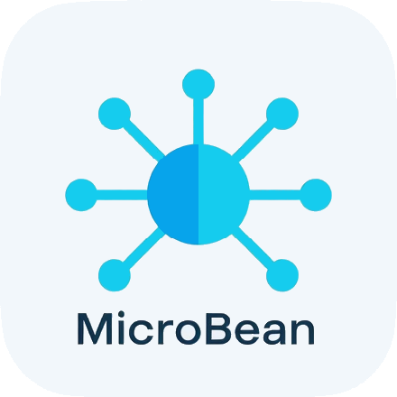

<div align="center">
  <table border="0" cellspacing="0" cellpadding="0">
    <tr>
      <td style="border: none; padding-right: 15px;">
        
      </td>
      <td style="border: none;">
<pre>
888b     d888 d8b                          888888b.
8888b   d8888 Y8P                          888  "88b
88888b.d88888                              888  .88P
888Y88888P888 888  .d8888b 888d888 .d88b.  8888888K.   .d88b.   8888b.  88888b.
888 Y888P 888 888 d88P"    888P"  d88""88b 888  "Y88b d8P  Y8b     "88b 888 "88b
888  Y8P  888 888 888      888    888  888 888    888 88888888 .d888888 888  888
888   "   888 888 Y88b.    888    Y88..88P 888   d88P Y8b.     888  888 888  888
888       888 888  "Y8888P 888     "Y88P"  8888888P"   "Y8888  "Y888888 888  888
</pre>
      </td>
    </tr>
  </table>
</div>


[](https://www.oracle.com/java/technologies/javase/jdk17-archive.html)
[](LICENSE)


## 📘 Description

**MicroBean Archetype** est un archétype Maven professionnel fournissant une structure de projet préconfigurée pour développer des applications micro-services basées sur le framework **MicroBean**. 

Cet archétype propose une architecture modulaire et extensible, suivant les bonnes pratiques Java modernes, avec une séparation claire des responsabilités et un support complet de l'injection de dépendances.

## ✨ Caractéristiques

- ✅ **Architecture Modulaire** : Organisation claire en couches (config, domain, gateway, service, model)
- ✅ **Injection de Dépendances** : Framework MicroBean intégré avec support complet
- ✅ **Configuration Centralisée** : Classe `Config` pour la gestion des beans
- ✅ **Pattern Adapter** : Implémentation du pattern Adapter pour les services multi-plateformes (Linux, Mac, Windows)
- ✅ **Architecture Hexagonale** : Séparation des interfaces API et SPI pour l'extensibilité
- ✅ **Tests Automatisés** : ArchUnit pour les tests d'architecture
- ✅ **Java 17+** : Compilation et exécution sur Java 17 ou supérieur

## 🗂️ Structure du Projet

```
.
├── src/
│   ├── main/
│   │   ├── java/
│   │   │   ├── Application.java              # Point d'entrée principal
│   │   │   ├── config/
│   │   │   │   └── Config.java               # Configuration des beans
│   │   │   ├── domain/
│   │   │   │   ├── MainService.java          # Service principal
│   │   │   │   ├── api/
│   │   │   │   │   └── ActionServiceAPI.java # Contrat d'API
│   │   │   │   ├── service/
│   │   │   │   │   └── ActionService.java    # Implémentation du service
│   │   │   │   ├── spi/
│   │   │   │   │   └── FileSPI.java          # Interface SPI
│   │   │   │   ├── model/
│   │   │   │   │   └── AnObject.java         # Modèle de données
│   │   │   │   └── gateway/
│   │   │   │       └── file/
│   │   │   │           ├── FileLinuxAdapter.java
│   │   │   │           ├── FileMacAdapter.java
│   │   │   │           └── FileWindowsAdapter.java
│   │   │   └── ...
│   │   └── resources/
│   └── test/
│       └── java/
│           └── ArchUnitTest.java             # Tests d'architecture
└── pom.xml                                   # Configuration Maven
```

## ✅ Prérequis

- **Java 17** ou supérieur
- **Maven 3.6.0** ou supérieur

## ⚙️ Installation

### 🚀 Générer un nouveau projet à partir de cet archétype

```bash
mvn archetype:generate \
  -DgroupId=com.example \
  -DartifactId=my-microbean-app \
  -Dversion=1.0.0 \
  -DarchetypeGroupId=com.jasonpercus.microbean \
  -DarchetypeArtifactId=MicroBean-archetype \
  -DarchetypeVersion=1.0.0 \
  -DinteractiveMode=false
```

### 🧭 Ou installation interactive

```bash
mvn archetype:generate \
  -DarchetypeGroupId=com.jasonpercus.microbean \
  -DarchetypeArtifactId=MicroBean-archetype \
  -DarchetypeVersion=1.0.0
```

## 🚀 Démarrage Rapide

### 1. Créer un nouveau projet

Utilisez les commandes d'installation ci-dessus pour générer votre projet.

### 2. Naviguer vers le répertoire du projet

```bash
cd my-microbean-app
```

### 3. Compiler le projet

```bash
mvn clean compile
```

### 4. Exécuter l'application

```bash
mvn exec:java -Dexec.mainClass="com.example.Application"
```

### 5. Exécuter les tests

```bash
mvn test
```

## 🧱 Architecture

### 🏛️ Couches Principales

#### ⚙️ Configuration (`config/`)
Contient les définitions des beans gérées par le conteneur MicroBean. Les beans sont déclarés avec l'annotation `@Bean` et peuvent avoir différents scopes (SINGLETON, PROTOTYPE, etc.).

#### 🧠 Domaine (`domain/`)
Cœur métier de l'application composé de :
- **API** : Contrats publics des services
- **Service** : Implémentation des services métier
- **SPI** : Interfaces pour les extensions (Service Provider Interface)
- **Model** : Modèles de données et entités
- **MainService** : Point d'entrée du service principal

#### 🌉 Gateway (`gateway/`)
Couche d'adaptation pour accéder aux ressources externes, implémentant le pattern Adapter pour supporter plusieurs plateformes.

### 🔌 Pattern Adapter

L'archétype fournit un exemple complet du pattern Adapter pour la gestion des fichiers multi-plateformes :

```java
// Interface SPI
public interface FileSPI {
    
    void writeFile(String path, String content);
    
    String readFile(String path);
}

// Implémentations par plateforme
public class FileLinuxAdapter implements FileSPI { ... }
public class FileMacAdapter implements FileSPI { ... }
public class FileWindowsAdapter implements FileSPI { ... }
```

## 📦 Dépendances Principales

| Dépendance    | Version | Scope   |
|---------------|---------|---------|
| MicroBean     | 1.0.0   | Runtime |
| JUnit Jupiter | 5.14.3  | Test    |
| ArchUnit      | 1.3.0   | Test    |

## 🧪 Tests

### ✅ Tests Unitaires

```bash
mvn test
```

### 🏗️ Tests d'Architecture (ArchUnit)

La classe `ArchUnitTest` fournit des tests d'architecture validant la structure du projet.

## 🛠️ Développement

### ➕ Ajouter une nouvelle dépendance

Modifiez le fichier `pom.xml` généré :

```xml
<dependency>
    <groupId>groupId.exemple</groupId>
    <artifactId>artifactId</artifactId>
    <version>1.0.0</version>
</dependency>
```

### 🧩 Créer un nouveau Service

1. Créez une interface API dans `domain/api/`
2. Créez l'implémentation dans `domain/service/`
3. Enregistrez le service comme bean dans `config/Config.java`

Exemple :

```java
// Interface
public interface MyServiceAPI {
    
    void doSomething();
}

// Implémentation
@Service
public class MyService implements MyServiceAPI {
    
    @Override
    public void doSomething() { ... }
}

// Configuration
@Bean
public MyServiceAPI myService() {
    
    return new MyService();
}
```

## 📌 Bonnes Pratiques

1. **Injection de Dépendances** : Utilisez toujours l'injection de dépendances plutôt que de créer des instances directement
2. **Séparation des Responsabilités** : Maintenez une séparation claire entre API et implémentation
3. **Tests Automatisés** : Écrivez des tests pour chaque nouveau service
4. **Configuration Centralisée** : Déclarez tous les beans dans la classe `Config`
5. **Pattern SPI** : Utilisez les SPI pour permettre l'extensibilité du code

## 📚 Ressources

- [Site Officiel MicroBean](https://github.com/jasonpercus/MicroBean)
- [Maven Archetype Guide](https://maven.apache.org/guides/introduction/introduction-to-archetypes.html)
- [ArchUnit Documentation](https://www.archunit.org/)
- [Java 17 Features](https://www.oracle.com/java/technologies/javase/jdk17-archive.html)

## 💬 Support

Pour des problèmes ou des questions :
- Ouvrez une issue sur [GitHub](https://github.com/jasonpercus/MicroBean-archetype)
- Consultez la documentation du [framework MicroBean](https://github.com/jasonpercus/MicroBean)

## 🤝 Contribution

Les contributions sont bienvenues ! Veuillez :

1. Fork le projet
2. Créer une branche pour votre fonctionnalité (`git checkout -b feature/amazing-feature`)
3. Committer vos changements (`git commit -m 'Add some amazing feature'`)
4. Pousser vers la branche (`git push origin feature/amazing-feature`)
5. Ouvrir une Pull Request

## 📄 Licence

Ce projet est licencié sous la [Licence MIT](LICENSE).

---

**Créé avec ❤️ par [Jason Percus](https://github.com/jasonpercus)**
